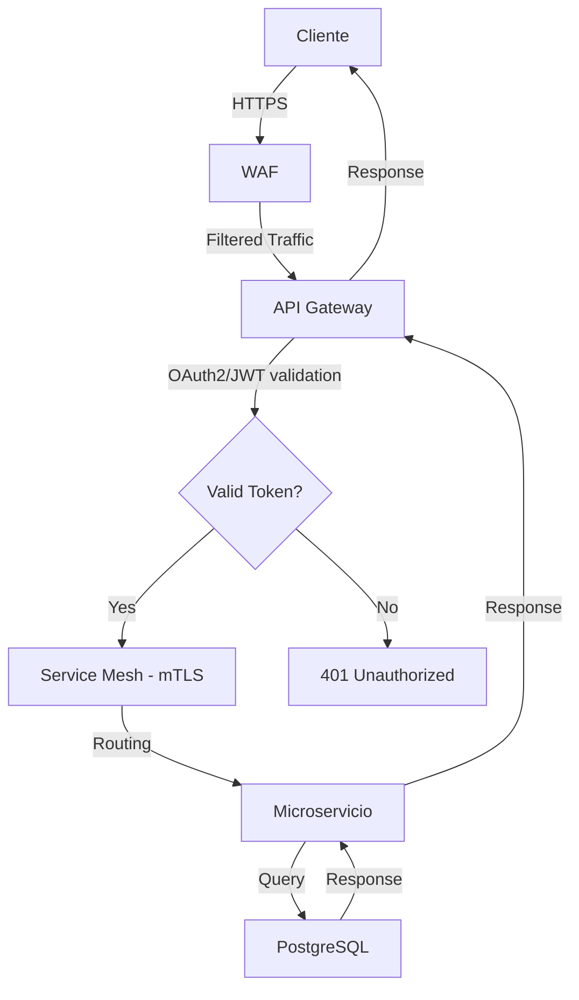

# 03. Arquitectura del Sistema

**Equipo:** Juan Lamolle, Serafín González, Fernando Rodríguez  
**Fecha:** Mayo 2026

---

### 3.1 Diagrama de Arquitectura

```
┌────────────────────────────────────────────────────────────┐
│ INTERNET (Untrusted Zone)                                  │
│ • Clientes web (navegadores)                               │
│ • Aplicaciones móviles                                     │
│ • APIs de terceros                                         │
│ • Actores maliciosos                                       │
└────────────────────────────────────────────────────────────┘
                         ↓ HTTPS
┌────────────────────────────────────────────────────────────┐
│  DMZ (Semi-trusted Zone)                                   |
│                                                            │
│  ┌──────────┐   ┌──────────────────┐   ┌────────────────┐  │
│  │   WAF    │ → │  API Gateway     │ → │  Redis Cache   │  │
│  │          │   │  (Kong/AWS)      │   │  (Sessions)    │  │
│  └──────────┘   └──────────────────┘   └────────────────┘  │
│                                                            │
│  • OAuth2/JWT validation                                   │
│  • Rate limiting                                           │
│  • Request routing                                         │
└────────────────────────────────────────────────────────────┘
                         ↓ mTLS
┌────────────────────────────────────────────────────────────┐
│  SERVICE MESH (Trusted Internal - Kubernetes Cluster)      │
│                                                            │
│  ┌───────────────────────────────────────────────────────┐ │
│  │ Istio Control Plane                                   │ │
│  │ • Certificate Management                              │ │
│  │ • Policy Enforcement                                  │ │
│  │ • Telemetry Collection                                │ │
│  └───────────────────────────────────────────────────────┘ │
│                                                            │
│  ┌──────────────┐  ┌──────────────┐  ┌──────────────┐      │
│  │ Users Svc    │  │ Inventory    │  │ Orders Svc   │      │
│  │ + Envoy      │  │ Svc + Envoy  │  │ + Envoy      │      │
│  │ Sidecar      │  │ Sidecar      │  │ Sidecar      │      │
│  └──────────────┘  └──────────────┘  └──────────────┘      │
│                                                            │
│  (mTLS between all services)                               │
└────────────────────────────────────────────────────────────┘
                         ↓ Encrypted connections
┌────────────────────────────────────────────────────────────┐
│  DATA LAYER (Highly Restricted)                            │
│                                                            │
│  ┌──────────────┐  ┌──────────────┐  ┌──────────────┐      │
│  │ PostgreSQL   │  │ RabbitMQ     │  │ Elasticsearch│      │
│  │ (User data)  │  │ (Msg queue)  │  │ (Logs)       │      │
│  └──────────────┘  └──────────────┘  └──────────────┘      │
│                                                            │
│  • Connection pooling                                      │
│  • Encrypted at rest                                       │
│  • Network isolation                                       │
└────────────────────────────────────────────────────────────┘
```

### 3.2 Flujo de Datos

**Flujo típico de una request:**



**1. Cliente → HTTPS → WAF**
- Validación de request
- Filtrado de ataques conocidos (SQL injection, XSS)
- Rate limiting por IP

**2. WAF → API Gateway**
- Validación de token JWT/OAuth2
- Verificación de permisos (scopes)
- Transformación de request si necesario
- Rate limiting por usuario
- Logging de request

**3. API Gateway → Service Mesh (Istio) → Microservicio**
- Establecimiento de conexión mTLS
- Validación de certificados
- Routing basado en headers
- Circuit breaking si servicio está degradado
- Retry logic con backoff

**4. Microservicio → Base de Datos**
- Connection pool
- Prepared statements (SQL)
- Validación de ownership (authorization)
- Transacciones ACID

**5. Microservicio → Response → API Gateway → Cliente**
- Logging de response
- Compresión
- Caching (si aplicable)

**Flujos adicionales:**

- **Async messaging:** Microservicio A → RabbitMQ → Microservicio B
- **Logging:** Todos los servicios → Fluentd → Elasticsearch
- **Metrics:** Istio → Prometheus → Grafana
- **Security events:** Falco → Alertas → PagerDuty

### 3.3 Actores del Sistema

| Actor | Descripción | Privilegios |
|-------|-------------|-------------|
| **Usuario final** | Cliente que usa la aplicación | CRUD en sus datos |
| **Usuario administrador** | Gestor del sistema | Acceso completo UI |
| **Desarrollador** | Equipo de ingeniería | Read K8s pods |
| **DevOps/SRE** | Operaciones de infraestructura | K8s admin, SSH nodes |
| **Security Team** | Equipo de seguridad | SIEM, audit logs |
| **Atacante externo** | Actor malicioso desde internet | Ninguno (evaluar) |
| **Atacante interno** | Insider threat / empleado malicioso | Según rol legítimo |
| **Sistema automatizado** | CI/CD pipeline, cron jobs | Deploy, backups |
| **Servicios terceros** | Payment gateway, email service | APIs específicas |

### 3.4 Trust Boundaries

#### **TB1: Internet ↔ DMZ**
- Todo tráfico desde internet es **NO CONFIABLE** hasta validación
- **Protocolo:** HTTPS obligatorio
- **Validación:** WAF + API Gateway authentication
- **Nivel de confianza:** 0% → 30% (post-autenticación)

#### **TB2: DMZ ↔ Service Mesh**
- Tráfico autenticado pero no completamente confiable
- **Protocolo:** mTLS obligatorio
- **Validación:** Certificados de Istio, RBAC policies
- **Nivel de confianza:** 30% → 70%

#### **TB3: Service Mesh ↔ Data Layer**
- Tráfico interno de servicios verificados
- **Protocolo:** Conexiones encriptadas (TLS to DB)
- **Validación:** Connection strings, credentials rotation
- **Nivel de confianza:** 70% → 90%

#### **TB4: Usuarios ↔ K8s Control Plane**
- Acceso administrativo al cluster
- **Protocolo:** kubectl con client certificates
- **Validación:** RBAC estricto, audit logging
- **Nivel de confianza:** Variable según rol

> **NOTA IMPORTANTE:** No existe confianza transitiva. Cada boundary requiere validación independiente. Por ejemplo, un servicio autenticado NO tiene acceso automático a la base de datos sin credentials propias.

---

[← Anterior: Inventario de Activos](02-inventario-activos.md) | [Siguiente: Análisis de Amenazas - Metodología STRIDE →](04-analisis-stride.md)